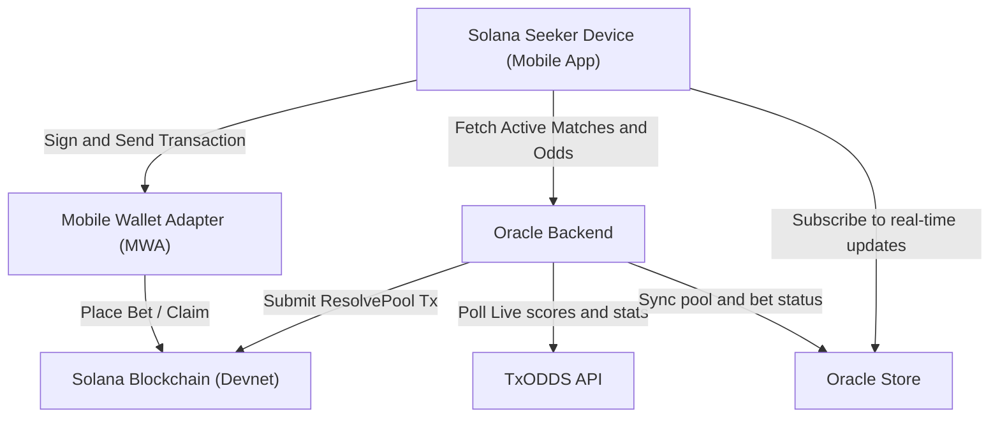

# MYLA Technical Architecture Specification

This document provides a comprehensive technical overview of the MYLA parimutuel prediction platform. It details the interaction between the frontend, the smart contracts, and the off-chain oracle, specifying data flows, State Models, and structural layouts.

---

## 1. System Architecture Overview

MYLA is designed as a real-time, decentralized, micro-prediction parimutuel game. All predictions are grouped into pools and settled on the Solana blockchain using a custom Anchor smart contract, resolved via an oracle feed powered by TxODDS live sports feeds.

### Component Relationship Diagram



### End-to-End Prediction Lifecycle
1. **Fixture Retrieval**: The React Native mobile app fetches live match fixtures directly from the TxODDS API, using a guest session activated by the user's on-chain subscription.
2. **Interactive Charting**: The React Native client visualizes live match metrics and probability curves using stepped SVG line charts.
3. **Transaction Packaging**: When a user selects a target (e.g. "Corners Over 5.5 at Minute 45") and specifies a stake, the client calls the Solana connection to derive the Pool PDA and build the atomic transaction.
4. **On-Chain Escrow**: The user authorizes the transaction via Mobile Wallet Adapter biometrics. If the pool PDA does not exist, the transaction atomically creates the pool and places the user's bet. The funds are held in a deterministic vault account.
5. **Oracle Resolution**: Once the target minute passes, the oracle script fetches the definitive statistics from the TxODDS scores snapshot, validates the result, signs the resolution transaction, and updates the pool state on-chain.
6. **Payout Distribution**: Bettors claim their proportional share of the winning side directly from the vault, with a 5% commission automatically routed to the treasury wallet.

---

## 2. Mobile App Architecture

The MYLA frontend is built on **React Native (Expo, TypeScript)**, designed for low-latency visual updates and seamless biometric confirmations.

### 2.1 Wallet Context (`WalletContext.tsx`)
The wallet integration acts as the bridge to the **Solana Mobile Stack (SMS)**:
- **Session Management**: Automatically stores the user's base58 address and MWA authorization token in React Native `AsyncStorage`.
- **Biometric Signing**: Implements standard MWA wrappers for `signMessage` and `signAndSendTransaction`. With the device handling the actual biometric authentication, the dApp never needs to store or handle private keys.
- **Platform Enforcements**: Verifies that the platform is Android and that an MWA provider is available, throwing descriptive user alerts if missing.

### 2.2 Live Match Hook (`useMatchContext.ts`)
Controls the simulation state, odds decay calculations, and transaction packing:
- **Odds Decay Engine**: Calculates payout multipliers using time-based decay algorithms:
  $$P_{\text{odds}} = 1.0 + (\text{initialMultiplier} - 1.0) \times e^{-\lambda t}$$
  This dynamically reduces payouts as the target minute approaches.
- **Atomic Bet Building**: Before invoking MWA, calls `buildAtomicBetTransaction` in the pool service to bundle the creation of the pool account and the deposit of the bet into a single atomic instruction.

### 2.3 Visualization & Charts
- **Stepped SVG Charts**: Custom rendering of historic match statistics (goals, corners, cards) using React Native SVG to provide users with a clean, scrollable visual reference.
- **Interactive target Selector**: Integrates absolute drag gestures mapped to specific target intervals (minute and level thresholds).

---

## 3. Solana Smart Contract Specification

The smart contracts are written using the **Solana Anchor framework** and are deployed on Devnet. And can be found in the anchor folder.

**Program ID (Devnet):** [`9AhsF4FXa6GPqVWJEaCdPeK3jptuGPfZpDk24Co5odsf`](https://solscan.io/account/9AhsF4FXa6GPqVWJEaCdPeK3jptuGPfZpDk24Co5odsf?cluster=devnet)

### 3.1 Account Models (`state.rs`)

#### 1. Pool Account
Represents a parimutuel prediction pool.
- **PDA Seeds**: `["pool", match_id, asset, strike_level, strike_minute]`
- **Structure**:
  ```rust
  pub struct Pool {
      pub match_id: String,           // Max 32 chars
      pub asset: String,              // Max 16 chars ("goals" | "corners" | "cards")
      pub strike_level: u16,          // Scaled x10 (e.g. 6.5 -> 65)
      pub strike_minute: u8,          // target minute
      pub deadline: i64,              // Unix timestamp after which bets close
      pub over_total: u64,            // Total lamports staked on Over
      pub under_total: u64,           // Total lamports staked on Under
      pub over_count: u32,            // Total Over bettors
      pub under_count: u32,           // Total Under bettors
      pub resolved: bool,             // Resolution state
      pub winning_side: Option<u8>,   // 0 = Over, 1 = Under
      pub actual_value: Option<u16>,  // Actual value scaled x10
      pub commission_rate: u16,       // Basis points (e.g. 500 = 5%)
      pub commission_wallet: Pubkey,  // Treasury destination
      pub oracle: Pubkey,             // Authorized resolver key
      pub bump: u8,                   // PDA bump seed
  }
  ```

#### 2. Bet Account
Tracks individual user stakes.
- **PDA Seeds**: `["bet", pool_address, user_address]`
- **Structure**:
  ```rust
  pub struct Bet {
      pub pool: Pubkey,               // Associated pool
      pub user: Pubkey,               // Bettor's wallet
      pub side: u8,                   // 0 = Over, 1 = Under
      pub amount: u64,                // Lamports staked
      pub claimed: bool,              // Claim status
      pub bump: u8,                   // PDA bump seed
  }
  ```

#### 3. Vault Account
A system-owned PDA that acts as the escrow account for stakes.
- **PDA Seeds**: `["vault", pool_address]`

### 3.2 Instructions (`lib.rs`)
- **`create_pool`**: Initializes the `Pool` account, configuring the oracle, commission wallet, deadline, and asset criteria.
- **`place_bet`**: Inserts a bet. Instantiates the `Bet` PDA and transfers SOL from the user's wallet directly into the `Vault` PDA. Updates the pool's totals and player counts.
- **`resolve_pool`**: Restricts caller to the authorized `oracle` address. Evaluates the actual value against the `strike_level` and marks `winning_side` (Over if `actual_value` > `strike_level`, Under otherwise).
- **`claim_winnings`**: Allocates vault funds. Calculates the winning share:
  $$\text{Payout} = \text{Stake} \times \left( \frac{\text{Total Pool} - \text{Commission}}{\text{Winning Side Total}} \right)$$
  Transfers the payout to the winner and the 5% commission to the `commission_wallet`.
- **`refund`**: Provides a fallback refund of the original stake if the pool did not attract players on one side (making parimutuel distribution impossible) or if the oracle failed to resolve the pool past its deadline.

---

## 4. Oracle & Backend Synchronization Specification

The oracle backend is implemented as a Node backend deployed as Firebase Cloud Function for the MVP.  Uses the TxODDS API to get the live data.

### 4.1 Resolution Loop (`resolvePools.ts`)
The script runs as a scheduled cron service to audit and resolve on-chain state:
1. **Solana Fetch**: Queries all active `Pool` accounts from the Solana blockchain using `program.account.pool.all()`.
2. **Firestore Sync**: Inserts or updates the pool records and active user bets inside Firestore (`pools` and `bets` collections) to provide fast indices for the frontend client.
3. **Target Evaluation**: If an unresolved pool's `deadline` has passed, the script triggers the resolution process.
4. **TxODDS Verification**: Issues an authorized HTTP GET request to the TxODDS Score Snapshot endpoint:
   `https://txline-dev.txodds.com/api/scores/snapshot/{matchId}`
5. **Statistic Extraction**: Parses the fixture events to determine the exact statistic value (e.g. total corners) at the specific `strike_minute`.
6. **On-Chain Settle**: Calls the Anchor program's `resolvePool` method, passing the scaled result value and signing the transaction with the oracle private key.

### 4.2 Helper Utilities
- **`scores.ts`**: Contains functions like `extractStatValue()` which process cumulative scores and event timelines returned by TxODDS, handling corner kicks, goals, and yellow/red cards.
- **`solana.ts`**: Initializes the read-write Anchor Program wrapper using a custom provider loaded with the oracle keypair credentials.
