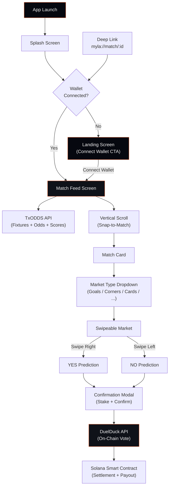

# MYLA App — Complete UI/UX Redesign & Implementation Plan (v2)

A phased plan to transform MYLA from a basic scaffold into a polished, hackathon-winning prediction app for World Cup 2026.

## Current State

The app has a basic tab navigator with placeholder screens (Home, Wallet, Profile, Leaderboard), mock data, and default Expo icons. All services (`txodds.ts`, `solana.ts`, `markets.ts`) are stubs with TODO comments. The design is generic dark cards on `#0F172A` backgrounds — functional but uninspiring.

---

## Decisions (Resolved)

| Question | Decision |
|---|---|
| Prediction market provider | **DuelDuck Prediction API** ([docs](https://docs.duelduck.com/overview)) — handles YES/NO prediction creation, voting, on-chain settlement, and reward distribution via Solana smart contracts |
| TxODDS credentials | User will obtain; leave `TXODDS_JWT` and `TXODDS_API_TOKEN` as `.env` variables |
| Wallet provider | **Solana Mobile Wallet Adapter** (Seeker / Saga) |
| Primary color | **Electric orange `#FF6B35`** — no pink accent |

---

## Proposed Changes

### Phase 1: Branding & Logo

Design a distinctive MYLA logo that communicates sports + prediction + Solana identity.

#### [NEW] [logo.png](file:///c:/Users/antoni/web_projects/myla/assets/logo.png)
- Generate a **MYLA logo** using the image generation tool
- Design direction: Bold, modern wordmark with a ⚽ element integrated into the "A" letterform, monochrome electric orange `#FF6B35` on dark `#06080F`
- Premium, crypto-native, sports-forward
- Generate at 1024×1024 for app icon

#### [NEW] [logo-wide.png](file:///c:/Users/antoni/web_projects/myla/assets/logo-wide.png)
- Wide/horizontal variant for splash screen and headers

#### [MODIFY] [app.json](file:///c:/Users/antoni/web_projects/myla/app.json)
- Update icon references to use new logo
- Update `userInterfaceStyle` to `"dark"`
- Add splash screen config with `backgroundColor: "#06080F"`
- Add deep link scheme: `"scheme": "myla"`

---

### Phase 2: Design System & Theme

Establish a cohesive design system before building any screens. The landing page and all subsequent screens will derive from these tokens.

#### [NEW] [theme.ts](file:///c:/Users/antoni/web_projects/myla/src/theme.ts)
A central design token file:
```
Colors:
  background:       #06080F (near-black)
  surface:          #0F1219 (card bg)
  surfaceElevated:  #161B26 (elevated card)
  border:           rgba(255,255,255,0.06)

  primary:          #FF6B35 (electric orange)
  primaryGlow:      rgba(255,107,53,0.15)
  primaryDark:      #CC5529 (pressed state)
  primaryLight:     #FF8C5A (hover / highlight)

  yes/green:        #00E676 (swipe right)
  no/red:           #FF1744 (swipe left)

  textPrimary:      #F5F5F7
  textSecondary:    #8E8E93
  textMuted:        #48484A

Typography:
  Display:  32px, weight 800
  Title:    24px, weight 700
  Body:     16px, weight 400
  Caption:  12px, weight 500

Spacing: 4, 8, 12, 16, 20, 24, 32, 48
Border Radius: 8, 12, 16, 20, 28
```

#### [NEW] [.env.example](file:///c:/Users/antoni/web_projects/myla/.env.example)
```
TXODDS_JWT=
TXODDS_API_TOKEN=
TXODDS_BASE_URL=https://txline.txodds.com
DUELDUCK_API_KEY=
DUELDUCK_BASE_URL=https://xapi.duelduck.com
```

---

### Phase 3: Splash Screen

A polished animated splash screen that auto-transitions.

#### [NEW] [SplashScreen.tsx](file:///c:/Users/antoni/web_projects/myla/src/screens/SplashScreen.tsx)
- Full-screen dark background (`#06080F`)
- MYLA logo centered with a **fade-in + scale-up** animation using React Native `Animated` API
- Subtle orange glow effect radiating from the logo
- "Powered by TxODDS × Solana" tagline fades in below
- Auto-navigates after ~2.5 seconds:
  - → **LandingScreen** if wallet not connected
  - → **MatchFeedScreen** if wallet connected
- Uses `expo-splash-screen` to manage native splash → custom splash transition

#### [MODIFY] [app.json](file:///c:/Users/antoni/web_projects/myla/app.json)
- Configure `splash.backgroundColor` to `#06080F`

---

### Phase 4: Landing / Wallet Connect Screen

If no wallet is connected, show a premium onboarding screen. **Theme matches the design system from Phase 2** — dark background with electric orange accents.

#### [NEW] [LandingScreen.tsx](file:///c:/Users/antoni/web_projects/myla/src/screens/LandingScreen.tsx)
- Full-screen immersive design:
  - Background: `#06080F` with subtle radial orange glow at bottom center
  - No tab bar, no header — fully immersive
- MYLA logo at top (wide horizontal variant)
- Hero area: animated soccer ball or stadium silhouette in muted orange tones
- Three key selling points as icon+text rows:
  - ⚡ "Predict live match events in real-time"
  - 🎯 "Swipe right for YES, left for NO"
  - 💰 "Win SOL instantly when you're right"
- Large **"Connect Wallet"** CTA button at bottom:
  - Solid `#FF6B35` background with subtle shadow/glow
  - Rounded corners (28px radius)
  - "Connect Wallet" text in white, weight 700
- Button triggers **Solana Mobile Wallet Adapter** connection
- On successful connection → navigate to MatchFeedScreen
- Subtle animated particles or floating soccer ball elements in the background

#### [NEW] [useWallet.ts](file:///c:/Users/antoni/web_projects/myla/src/hooks/useWallet.ts)
- React hook wrapping Solana Mobile Wallet Adapter state
- `isConnected`, `address`, `balance`, `connect()`, `disconnect()`
- Uses `@solana-mobile/mobile-wallet-adapter-protocol` for real Seeker integration
- Fallback for development: simulated wallet state with `AsyncStorage` persistence

#### [NEW] [WalletContext.tsx](file:///c:/Users/antoni/web_projects/myla/src/context/WalletContext.tsx)
- React Context provider for wallet state, wraps the entire app
- Provides `walletAddress`, `isConnected`, `connect`, `disconnect` to all screens

---

### Phase 5: Match Feed — TikTok-Style Vertical Scroll

The core experience. Replace the current FlatList with a fullscreen, snapping, swipeable match feed.

#### [NEW] [MatchFeedScreen.tsx](file:///c:/Users/antoni/web_projects/myla/src/screens/MatchFeedScreen.tsx)
- **Full-screen vertical FlatList** with `pagingEnabled={true}` and `snapToInterval={SCREEN_HEIGHT}`
- Each item fills the entire viewport (like TikTok/Reels)
- Data source: matches from TxODDS API (initially mock, then real)
- At the **top of each match card**: market type pill selector
- Floating mini wallet badge (top-right corner) showing SOL balance

#### [NEW] [MatchCard.tsx](file:///c:/Users/antoni/web_projects/myla/src/components/MatchCard.tsx)
A single full-screen match card containing:
- **Top bar**: Market type pills (horizontally scrollable)
- **Match info section**:
  - Country flag emojis or team badge images
  - Team names
  - Live score (large, prominent)
  - Match minute with pulsing 🔴 LIVE indicator
  - Competition name (e.g., "FIFA World Cup 2026 — Round of 16")
- **Market question** (large text): e.g., "Will a goal be scored in the next 15 minutes?"
- **Current odds** displayed as a visual probability bar (YES % / NO %)
- **Swipe hint arrows**: ← NO | YES → with color coding (red left, green right)
- **Pool info**: Total staked, time remaining
- Background: subtle gradient with team color accent

#### [NEW] [SwipeableMarket.tsx](file:///c:/Users/antoni/web_projects/myla/src/components/SwipeableMarket.tsx)
- Wraps the market content in a **horizontal swipe gesture handler**
- Uses `react-native-gesture-handler` + `react-native-reanimated`
- **Swipe right**: card tilts right, green glow overlay, "YES ✓" label animates in → triggers YES prediction
- **Swipe left**: card tilts left, red glow overlay, "NO ✗" label animates in → triggers NO prediction
- **Partial swipe**: follows finger with spring physics, snaps back if not past threshold
- Haptic feedback on threshold cross (via `expo-haptics`)

#### [NEW] [MarketDropdown.tsx](file:///c:/Users/antoni/web_projects/myla/src/components/MarketDropdown.tsx)
- Horizontally scrollable pill/chip bar at the top of each match card
- Pills: `Goals` | `Corners` | `Cards` | `Over/Under` | `Subs`
- Active pill: solid `#FF6B35` background
- Inactive pills: transparent with `rgba(255,255,255,0.06)` border
- Tapping a pill fetches markets of that type and updates the SwipeableMarket content

---

### Phase 6: TxODDS API Integration

Replace mock data with real World Cup data.

#### [MODIFY] [txodds.ts](file:///c:/Users/antoni/web_projects/myla/src/services/txodds.ts)
Complete rewrite of the TxODDS service:

**Authentication:**
- Read `TXODDS_JWT` and `TXODDS_API_TOKEN` from env
- All requests use headers: `Authorization: Bearer ${jwt}`, `X-Api-Token: ${apiToken}`

**Key endpoints:**

| Endpoint | Purpose |
|---|---|
| `GET /api/fixtures/snapshot` | Fetch all World Cup fixtures |
| `GET /api/odds/snapshot/:fixtureId` | Get odds for a specific match |
| `GET /api/scores/snapshot/:fixtureId` | Get scores for a specific match |
| `GET /api/scores/updates/:fixtureId` | Live score updates |
| `GET /api/odds/stream` (SSE) | Real-time odds streaming |
| `GET /api/scores/stream` (SSE) | Real-time score streaming |

**Data mapping:**
- `Participant1` / `Participant2` → home/away teams (check `Participant1IsHome`)
- Score stats: keys 1=P1 goals, 2=P2 goals, 3=P1 yellow, 4=P2 yellow, 5=P1 red, 6=P2 red, 7=P1 corners, 8=P2 corners
- Game phases: NS(1), H1(2), HT(3), H2(4), F(5), etc.

#### [NEW] [txoddsTypes.ts](file:///c:/Users/antoni/web_projects/myla/src/types/txodds.ts)
- TypeScript interfaces: `TxFixture`, `TxOddsSnapshot`, `TxScoreUpdate`, `TxGamePhase`

#### [MODIFY] [useMatchFeed.ts](file:///c:/Users/antoni/web_projects/myla/src/hooks/useMatchFeed.ts)
- Replace `MOCK_MATCHES` with real TxODDS fixture fetching
- Polling interval (60s for free tier) or SSE for real-time
- Filter for World Cup competition
- Sort: live matches first, then upcoming by start time

---

### Phase 6.5: Fix TxODDS Auth & Data Visibility

Fix the broken data pipeline — games and predictions are not showing up because the TxODDS service is never initialized and has URL construction bugs.

#### Root Cause Analysis

1. **Service never configured**: `txoddsService.configure()` is never called — `isConfigured` is always `false` so every API call returns `[]`.
2. **Double `/api/` URL bug**: `baseURL` is set to `.../api` but paths also start with `/api/...` → requests hit `.../api/api/fixtures/snapshot` (404).
3. **Free tier auth not implemented**: The free tier requires a **guest JWT** from `POST /auth/guest/start` + an on-chain subscription + activation. Nothing in the current code does this.
4. **No fallback data**: When the API isn't yet activated, no matches or markets show — users see a blank screen.

#### What's in the TxODDS Free Tier

- **Service Level 1**: World Cup + International Friendlies with 60-second delay (free)
- **Service Level 12**: World Cup + International Friendlies real-time (free on mainnet)
- **Auth flow**: `POST /auth/guest/start` → on-chain `subscribe` tx → `POST /api/token/activate` → use `Bearer {jwt}` + `X-Api-Token: {token}`
- **Known fixture IDs** from the published schedule (usable as seed data)

#### [MODIFY] [txodds.ts](file:///c:/Users/antoni/web_projects/myla/src/services/txodds.ts)

Fix and rewrite:
- **Fix baseURL**: Use `https://txline.txodds.com` (no `/api` suffix) — paths in requests use `/api/...`
- **Add `initGuestSession()`**: Auto-calls `POST /auth/guest/start` to get JWT, stored in memory + `AsyncStorage`
- **Add `activateWithToken(txSig, walletSignature, leagues)`**: Calls `POST /api/token/activate` and stores the API token
- **Add `isGuestOnly` state**: When only guest JWT is present (no activated token), only `GET /api/fixtures/snapshot` is available (no odds/scores without token)
- **Add seed fixtures**: Hardcode the World Cup 2026 fixture schedule (with real fixture IDs) as fallback data when API returns empty or errors

#### [NEW] [useTxOddsAuth.ts](file:///c:/Users/antoni/web_projects/myla/src/hooks/useTxOddsAuth.ts)

- Hook that manages the TxODDS auth lifecycle
- On mount: checks `AsyncStorage` for cached JWT + API token
- If no cached JWT: calls `POST /auth/guest/start` and saves the JWT
- Exposes `authState`: `'loading' | 'guest' | 'activated' | 'error'`
- Exposes `activateSubscription(txSig, walletSignature)` for after on-chain subscribe

#### [MODIFY] [useMatchFeed.ts](file:///c:/Users/antoni/web_projects/myla/src/hooks/useMatchFeed.ts)

- Integrate `useTxOddsAuth` — wait for auth before fetching
- When auth state is `'guest'` or `'activated'`, proceed with API calls
- When API returns empty (no subscribed fixtures yet), fall back to **seed fixture data** with mock scores/markets
- Seed data: use real World Cup 2026 fixture IDs from the schedule

#### [NEW] [worldcupSeed.ts](file:///c:/Users/antoni/web_projects/myla/src/data/worldcupSeed.ts)

Hardcoded World Cup 2026 fixture data from the TxODDS schedule:
- Real fixture IDs (e.g. `18209181` = France vs Morocco Quarter-final)
- Correct team names, start times
- Realistic mock scores for past matches
- Mock markets with YES/NO outcomes for demonstration

---

### Phase 7: DuelDuck Prediction Market Integration

Integrate DuelDuck for on-chain prediction creation, voting, and settlement.

#### [NEW] [duelduck.ts](file:///c:/Users/antoni/web_projects/myla/src/services/duelduck.ts)
DuelDuck API service:

**Base URL:** `https://xapi.duelduck.com`
**Auth:** `X-API-Key: ${DUELDUCK_API_KEY}` header for all project-scoped requests

**Core flow:**
1. **Create prediction** (server-side / backend triggers this when a new market opens):
   - Question: "Will a goal be scored in the next 15 minutes?"
   - YES / NO outcomes
   - Deadline: market close time
   - Currency: SOL
   - Fee: configurable (1-10%)

2. **User participation** (client-side):
   - User connects wallet → selects YES or NO via swipe
   - Sends vote transaction to DuelDuck's Solana smart contract
   - Non-custodial: user signs with their wallet directly

3. **Resolution** (backend triggers after TxODDS event confirms outcome):
   - Call DuelDuck resolve endpoint with winning outcome
   - Smart contract auto-distributes rewards to winners

**DuelDuck prediction lifecycle mapping:**

| MYLA Action | DuelDuck API |
|---|---|
| Market opens | `POST /duels` — create prediction |
| User swipes YES/NO | User signs on-chain vote transaction |
| Market resolves | `POST /duels/:id/resolve` — resolve with YES/NO |
| Payout | Automatic via Solana smart contract |

#### [NEW] [duelduckTypes.ts](file:///c:/Users/antoni/web_projects/myla/src/types/duelduck.ts)
- `DuelDuckPrediction`, `DuelDuckVote`, `DuelDuckOutcome`, `DuelDuckResolution`

#### [MODIFY] [markets.ts](file:///c:/Users/antoni/web_projects/myla/src/services/markets.ts)
- Bridge between TxODDS data (match events) and DuelDuck (prediction markets)
- When TxODDS reports a match event → generate appropriate DuelDuck prediction
- Map TxODDS fixture odds → initial probabilities for DuelDuck market display

---

### Phase 8: Prediction Confirmation & Feedback

When a user swipes to predict, show a confirmation flow.

#### [NEW] [PredictionModal.tsx](file:///c:/Users/antoni/web_projects/myla/src/components/PredictionModal.tsx)
- Bottom sheet modal that slides up after a successful swipe
- Shows:
  - The prediction: "You predicted **YES** — Goal in next 15 min"
  - Stake selector: preset amounts (0.01, 0.05, 0.1, 0.5 SOL) as pill buttons
  - Current odds / potential payout display
  - **"Confirm"** button (solid `#FF6B35`)
  - "Cancel" to dismiss
- On confirm → sends vote transaction to DuelDuck smart contract via wallet
- Success animation: checkmark with confetti burst

#### [NEW] [usePredictionFlow.ts](file:///c:/Users/antoni/web_projects/myla/src/hooks/usePredictionFlow.ts)
- Manages prediction submission state: `idle` → `confirming` → `signing` → `submitted` → `confirmed` / `failed`
- Integrates with Solana Mobile Wallet Adapter for transaction signing
- Calls DuelDuck smart contract for on-chain vote

---

### Phase 9: Navigation Restructure & Deep Linking

Replace the current tab navigator with a flow-based navigation, and add deep link support for sharing specific matches.

#### [MODIFY] [AppNavigator.tsx](file:///c:/Users/antoni/web_projects/myla/src/navigation/AppNavigator.tsx)
New navigation structure:
```
Stack Navigator (root)
├── Splash Screen (initial)
├── Landing Screen (if !wallet connected)
└── Main Stack (if wallet connected)
    ├── MatchFeed (fullscreen, primary experience)
    ├── PredictionHistory (modal)
    ├── Profile (modal)
    └── Settings (modal)
```

- **Remove bottom tab navigator** — fullscreen TikTok-style doesn't pair with tabs
- Access profile/history via a menu icon or gesture from the match feed
- Floating **mini wallet badge** in top-right showing SOL balance

#### Deep Link Configuration

**URL Scheme:** `myla://`

| Deep Link | Action |
|---|---|
| `myla://match/:fixtureId` | Open the app and scroll to a specific match in the feed |
| `myla://match/:fixtureId/:marketType` | Open a specific match with a market type pre-selected |

**Implementation:**

#### [MODIFY] [app.json](file:///c:/Users/antoni/web_projects/myla/app.json)
```json
{
  "expo": {
    "scheme": "myla",
    "android": {
      "intentFilters": [
        {
          "action": "VIEW",
          "autoVerify": true,
          "data": [
            { "scheme": "myla" }
          ],
          "category": ["BROWSABLE", "DEFAULT"]
        }
      ]
    }
  }
}
```

#### [NEW] [linking.ts](file:///c:/Users/antoni/web_projects/myla/src/navigation/linking.ts)
- React Navigation linking configuration
- Maps `myla://match/:fixtureId` → `MatchFeed` screen with `initialMatchId` param
- Maps `myla://match/:fixtureId/:marketType` → `MatchFeed` screen with both `initialMatchId` and `initialMarketType`

#### [NEW] [useDeepLink.ts](file:///c:/Users/antoni/web_projects/myla/src/hooks/useDeepLink.ts)
- Hook that listens for incoming deep links via `expo-linking`
- On `myla://match/:fixtureId`:
  1. If wallet not connected → show Landing screen first, then navigate after connection
  2. If wallet connected → scroll the MatchFeed to the target fixture
- Uses `Linking.getInitialURL()` for cold starts and `Linking.addEventListener` for warm starts
- Passes `fixtureId` to `MatchFeedScreen` which auto-scrolls to that match index

#### [NEW] [ShareButton.tsx](file:///c:/Users/antoni/web_projects/myla/src/components/ShareButton.tsx)
- Small share icon on each match card
- Generates `myla://match/:fixtureId` deep link
- Uses `Share.share()` from React Native to open the system share sheet
- Share text: "🏆 Predict the next goal in Brazil vs Croatia LIVE on MYLA! myla://match/17952170"

---

### Phase 10: Polish & Animations

#### Install required dependencies:
```bash
npx expo install react-native-gesture-handler react-native-reanimated expo-haptics expo-linear-gradient expo-splash-screen expo-linking @solana-mobile/mobile-wallet-adapter-protocol
```

#### Animation details:
- **Splash → Landing**: crossfade transition
- **Landing → MatchFeed**: slide-up reveal
- **Market pill selection**: spring animation with scale bounce
- **Swipe gestures**: 60fps interpolated transforms using `react-native-reanimated`
- **Score updates**: number counter animation when goals change
- **LIVE indicator**: pulsing red dot with opacity animation
- **Prediction confirmation**: bottom sheet slide-up with backdrop blur

---

## Architecture Overview



---

## Phase Summary

| Phase | Deliverable | Effort |
|-------|------------|--------|
| 1 | Logo & branding assets | ~1 hour |
| 2 | Design system / theme tokens + .env setup | ~30 min |
| 3 | Splash screen with animation | ~2 hours |
| 4 | Landing / wallet connect screen (themed) | ~3 hours |
| 5 | Match feed + swipe mechanics | ~6 hours |
| 6 | TxODDS API integration | ~4 hours |
| 6.5 | Fix TxODDS auth & data visibility (guest JWT + seed data) | ~2 hours |
| 7 | DuelDuck prediction market integration | ~4 hours |
| 8 | Prediction confirmation flow | ~3 hours |
| 9 | Navigation restructure + deep linking | ~3 hours |
| 10 | Polish & animations | ~3 hours |
| **Total** | **Full redesign** | **~29.5 hours** |

---

## Verification Plan

### Automated Tests
- None initially (hackathon pace) — can add snapshot tests post-MVP

### Manual Verification
- Run `npx expo start` and test on Android emulator / Seeker device
- Verify splash → landing → connect → feed flow
- Test swipe gestures (left/right for YES/NO) and snap scrolling (up/down)
- Confirm TxODDS API returns live World Cup fixture data
- Test market type switching via dropdown pills
- Validate prediction confirmation modal → DuelDuck on-chain vote
- Test deep link: `adb shell am start -a android.intent.action.VIEW -d "myla://match/17952170"`
- Test share button generates correct deep link

### Key Checkpoints
1. After Phase 3: Splash screen animates and transitions correctly
2. After Phase 5: Can vertically scroll through matches and swipe left/right
3. After Phase 6: Real match data appears from TxODDS
4. After Phase 6.5: Games and prediction markets display correctly even before API token activation
4. After Phase 7: Predictions submit to DuelDuck and record on Solana
5. After Phase 9: Deep links open specific matches
6. After Phase 10: Full flow is polished and demo-ready
